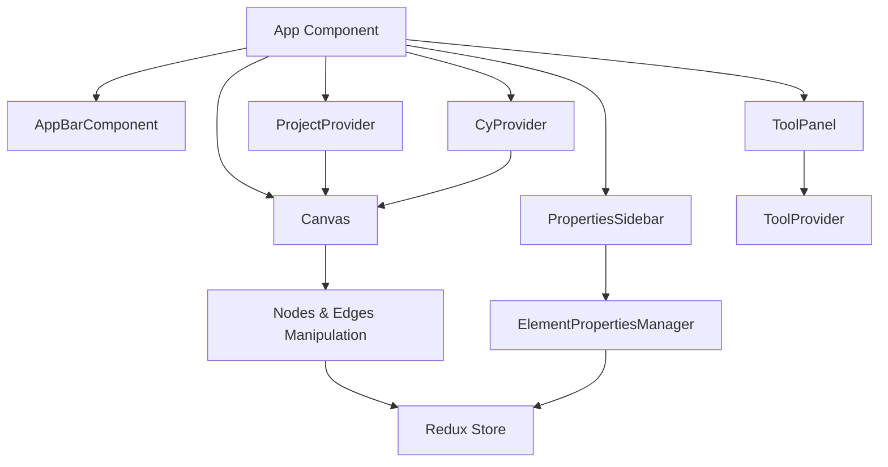

# Application Breakdown

# m_designer Application

## Overview
The **m_designer** application is a web-based design tool for creating and managing layouts or maps, using a graphical interface for interacting with nodes, edges, and other design elements. The app is built with **React** for the front-end, **Redux** for state management, and **Material-UI** for a modern, responsive UI.

## Architecture Diagram

1. App Component
The root component that ties together all the main parts of the application, including the canvas, tool panel, and properties sidebar. It provides the overall layout and flow for the user interface.

2. AppBarComponent
Manages the top navigation bar, which may include options like file management, undo/redo buttons, and other global controls.

3. Canvas
The core of the application where the user interacts with the design. The canvas allows users to manipulate nodes, edges, and other graphical elements in real-time. It uses the following:

    **CyProvider**: Provides the context for managing and rendering graph elements like nodes and edges.
    
    **Redux Store**: Handles the state of the current project, including node positions, edge connections, and any real-time updates.
4. ToolPanel
A panel that allows users to select different tools, such as adding nodes, connecting edges, or moving elements. It uses:

ToolProvider: Provides context related to the selected tool and manages tool-specific logic.

5. PropertiesSidebar
Displays and allows users to modify properties of the currently selected design element (e.g., a node or edge). It interacts with:

    **ElementPropertiesManager**: Manages the properties of the selected element and updates the Redux Store accordingly.

    **Redux Store**: Keeps the state of the selected element in sync with the application.

6. ProjectProvider
Manages the overall state of the project, including the current layout, zoom level, and active nodes/edges. It coordinates with the Canvas and Redux Store to ensure the state is always consistent.

7. CyProvider
Provides functionality related to the Cytoscape.js library (or a similar graph library), which is likely being used for managing and rendering graphs on the canvas.

8. Nodes & Edges Manipulation
Handles adding, removing, or modifying nodes and edges on the canvas. This logic interacts with the Redux Store to keep the application state synchronized.

9. ElementPropertiesManager
Responsible for managing the properties of the currently selected element on the canvas, including updating the element's properties via the Redux Store.

# Interfaces
1. Internal Interfaces
Canvas ↔ ToolPanel: The canvas interacts with the selected tool to modify elements (e.g., node addition, edge drawing) as the user interacts with the tool panel.
Canvas ↔ PropertiesSidebar: When an element is selected on the canvas, the properties sidebar is updated to reflect the properties of that element, allowing for real-time modifications.
Redux Store ↔ All Components: Centralized state management that ensures all parts of the UI reflect the current project state and user interactions.

2. External Interfaces
Backend API (Future Development): In a future iteration, the app might interact with a backend API for saving/loading projects, user authentication, and real-time collaboration. This API would likely interface with the Redux Store to send/receive project data.
File Import/Export: The app may provide functionality to import/export design projects in a specific file format (e.g., JSON), allowing users to save their work locally or share it with others.

# Technology Stack
**React** : Provides a modular component-based structure for the UI.

**Redux**: Manages the state of the project and ensures consistency across different components.

**Material-UI**: Supplies modern, accessible UI components and a responsive design.

**Cytoscape.js**: A powerful graph library that handles rendering and manipulating graphs on the canvas.

# Future Considerations
**Multi-User Collaboration**: The app can be extended to allow multiple users to edit the same project simultaneously using WebSockets or a similar real-time communication protocol.

**Backend Integration**: Saving projects to a database or cloud storage for persistence and collaboration.

**Undo/Redo Functionality**: Integration of a robust undo/redo system tied into the Redux state to allow users to easily revert changes.

# Inconsistencies and Areas for Improvement
1. **Component Naming and Organization**: Some components, like AppBarComponent, are named with a suffix that is redundant given their file location. Consistent naming conventions and organization can improve readability and maintainability.

2. **State Management Complexity**: While Redux is powerful, it can add complexity. The app should ensure that Redux is used only where necessary and consider using local component state or context for simpler state management needs.

3. **Code Duplication and Reusability**: There might be opportunities to refactor and reuse code across components. For instance, similar styled components or logic could be abstracted into utility functions or shared components.

4. **Error Handling and User Feedback**: The app should ensure robust error handling and provide user feedback for actions like exporting data or creating new projects. This can enhance the user experience and prevent silent failures.

5. **Performance Considerations**: The app should be mindful of performance, especially in components like Canvas that may handle complex rendering tasks. Techniques like memoization and lazy loading can be employed to optimize performance.

6. **Testing and Documentation**: Comprehensive testing and documentation are crucial for maintaining an enterprise-level application. The app should ensure that all components and functionalities are well-tested and documented.

By addressing these inconsistencies and leveraging the strengths of React, the app can provide a robust and scalable solution for its intended purpose.