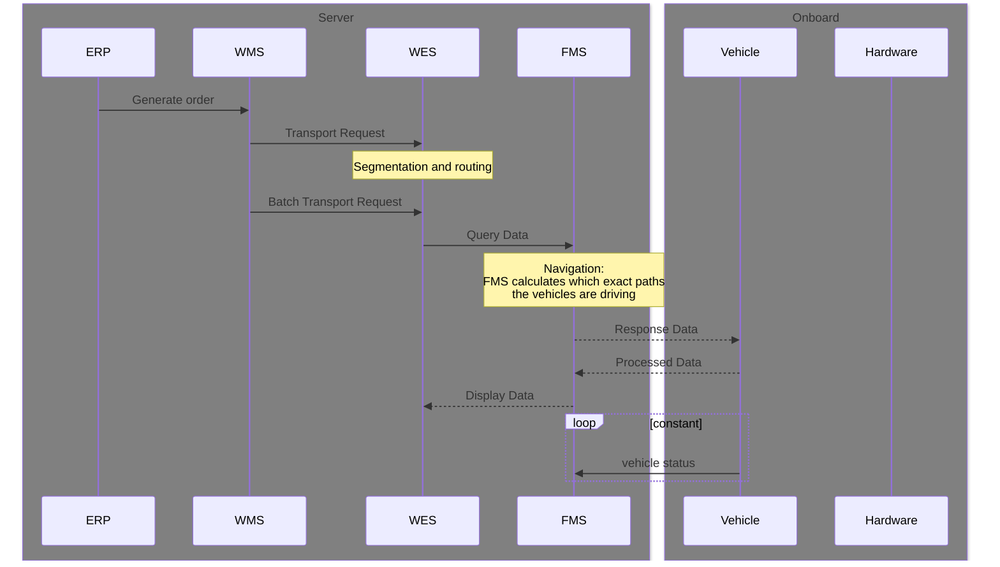
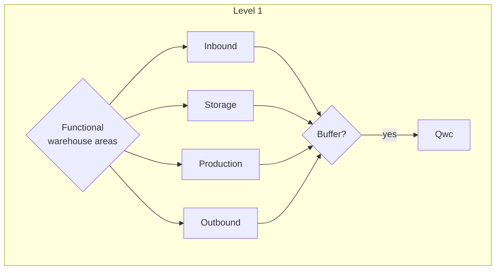
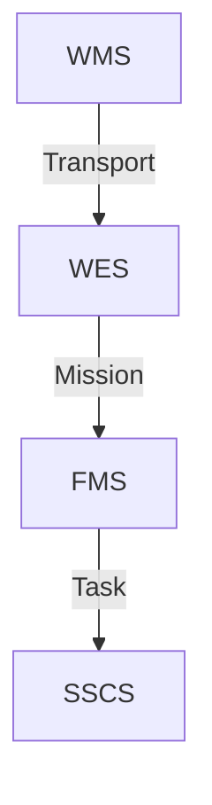
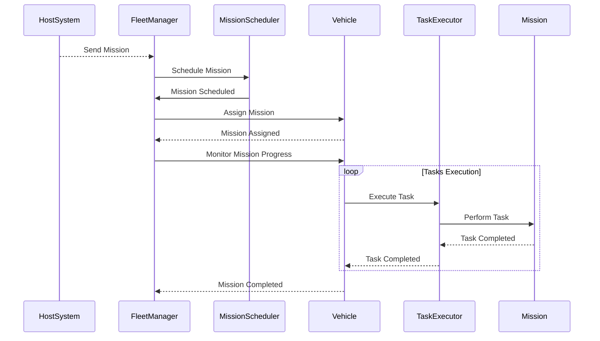

# Sequence overview


## System definitions
Fleet management:
- Vehicle task management = what are all vehicles doing
- Vehicle traffic managmeent = where are all vehicles driving
- Vehicle energy management = how long can the vehicles still drive

- Vehicle assignment -> assign a vehicle to a task
- Vehicle navigation -> calculate the exact path a vehicle has to take to execute a task
- 


## System design flow
### Environment definition 
-> vehicle selection <br>
-> Segmentation <br>

### Logic definition
-> Order generation <br>
-> Vehicle assignment <br>
-> Energy managment <br>


1. Define the flows through the key areas in the warehouse
2. Define the area locations
3. Define how the flow should be triggered
3. Define any obstacles or transport behavior
4




# Transport definition



## Point -> Point
```json
{
    "id":"Transport1",
    "sourcelocation": "INBOUND_1A",
    "destinationlocation": "PRODUCTION_2C"
    "load": {
        "id": "load_id",
        "type": "EURO"
    },
    "deadline": "2023-09-21T14:00:00Z"
}

```

## Point -> Area

```json
{
    "id":"Transport1",
    "sourcearea": "INBOUND_1",
    "destinationarea": "PRODUCTION_2"
    "load": {
        "id": "load_id",
        "type": "EURO"
    },
    "deadline": "2023-09-21T14:00:00Z"
}

```

# Mission definition


```mermaid
block-beta
    block AGVFleetManager {
        block "Task Manager" as TaskManager
        block "Energy Manager" as EnergyManager
        block "Vehicle Controller" as VehicleController
    }
    AGVFleetManager -[hidden]- TaskManager : internal component
    AGVFleetManager -[hidden]- EnergyManager : internal component
    AGVFleetManager -[hidden]- VehicleController : internal component
    TaskManager -[hidden]-> "Host System" : interface
    EnergyManager -[hidden]-> "Charger" : interface

```
